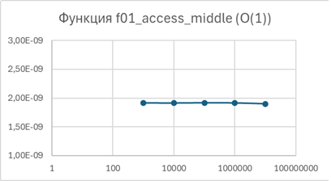
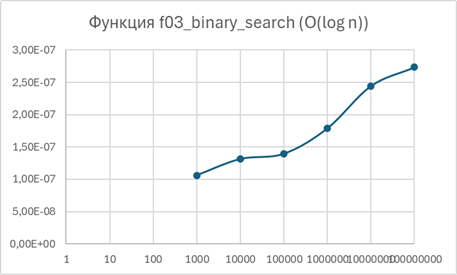
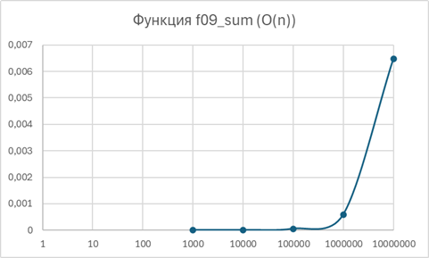
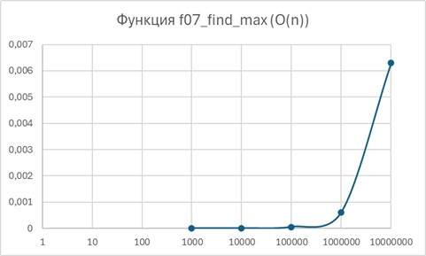
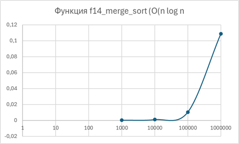
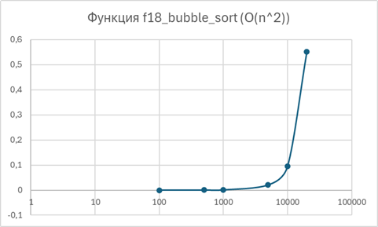
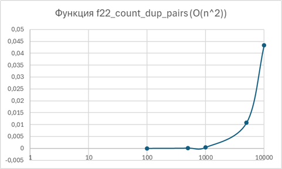
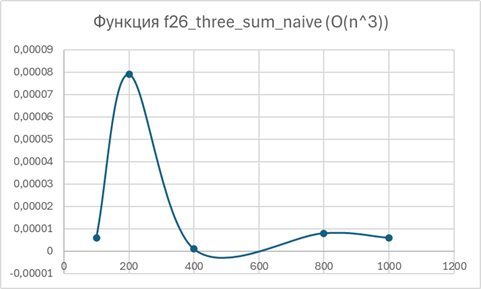
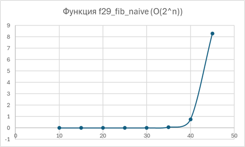

# Группа ИДБ-25-06, 16.03.2026, Лабораторная работа №1, Зинин П.А.

## Вводные данные

- язык программирования: C++
- операционная система: Windows

## Перечень функций

### Группа 1: O(1) — константная сложность

1. `f01_access_middle` — доступ к среднему элементу массива

### Группа 2: O(log n) — логарифмическая сложность

3. `f03_binary_search` — бинарный поиск элемента

### Группа 3: O(n) — линейная сложность

5. `f09_sum` — сумма всех элементов
6. `f07_find_max` — поиск максимального элемента

### Группа 4: O(n log n) — линеарифмическая сложность

7. `f14_merge_sort` — сортировка слиянием

### Группа 5: O(n²) — квадратичная сложность

8. `f18_bubble_sort` — сортировка пузырьком
9. `f22_count_dup_pairs` — подсчет дублирующихся пар

### Группа 6: O(n³) — кубическая сложность

10. `f26_three_sum_naive` — поиск тройки чисел с заданной суммой

### Группа 7: O(2ⁿ) — экспоненциальная сложность

11. `f29_fib_naive` — вычисление чисел Фибоначчи (рекурсия)

---
Код:
> [laba1.cpp](laba1.cpp)

## Таблицы результатов и графики

### Функция f01_access_middle (O(1))

| Размер n | Время (сек) |
|----------|-------------|
| 1000 | 1.92E-09 |
| 10000 | 1.91E-09 |
| 100000 | 1.92E-09 |
| 1000000 | 1.92E-09 |
| 10000000 | 1.90E-09 |

---

### Функция f03_binary_search (O(log n))

| Размер n | Время (сек) |
|----------|-------------|
| 1000 | 1.06E-07 |
| 10000 | 1.31E-07 |
| 100000 | 1.39E-07 |
| 1000000 | 1.79E-07 |
| 10000000 | 2.44E-07 |
| 100000000 | 2.74E-07 |

---

### Функция f09_sum (O(n))

| Размер n | Время (сек) |
|----------|-------------|
| 1000 | 0.0000007 |
| 10000 | 0.0000056 |
| 100000 | 0.0000552 |
| 1000000 | 0.0005955 |
| 10000000 | 0.0064783 |

---

### Функция f07_find_max (O(n))

| Размер n | Время (сек) |
|----------|-------------|
| 1000 | 0.0000008 |
| 10000 | 0.0000057 |
| 100000 | 0.0000562 |
| 1000000 | 0.0006115 |
| 10000000 | 0.0062945 |

---

### Функция f14_merge_sort (O(n log n))

| Размер n | Время (сек) |
|----------|-------------|
| 1000 | 0.000107 |
| 10000 | 0.000873 |
| 100000 | 0.010088 |
| 1000000 | 0.108515 |

---

### Функция f18_bubble_sort (O(n²))

| Размер n | Время (сек) |
|----------|-------------|
| 100 | 0.000016 |
| 500 | 0.000329 |
| 1000 | 0.000972 |
| 5000 | 0.020784 |
| 10000 | 0.095399 |
| 20000 | 0.551926 |

---

### Функция f22_count_dup_pairs (O(n²))

| Размер n | Время (сек) |
|----------|-------------|
| 100 | 0.000032 |
| 500 | 0.000137 |
| 1000 | 0.000446 |
| 5000 | 0.010762 |
| 10000 | 0.043364 |

---

### Функция f26_three_sum_naive (O(n³))

| Размер n | Время (сек) |
|----------|-------------|
| 100 | 0.000006 |
| 200 | 0.000079 |
| 400 | 0.000001 |
| 800 | 0.000008 |
| 1000 | 0.000006 |

---

### Функция f29_fib_naive (O(2ⁿ))

| n | Время (сек) |
|---|-------------|
| 10 | 0.000001 |
| 15 | 0.000008 |
| 20 | 0.000121 |
| 25 | 0.000639 |
| 30 | 0.006035 |
| 35 | 0.067046 |
| 40 | 0.748309 |
| 45 | 8.289314 |

---

## Заключение

В ходе лабораторной работы были реализованы и протестированы алгоритмы с различной вычислительной сложностью:
- **O(1)**: время выполнения не зависит от размера входных данных
- **O(log n)**: время растет медленно, пропорционально логарифму
- **O(n)**: линейный рост времени
- **O(n log n)**: эффективные алгоритмы сортировки
- **O(n²)**: квадратичный рост (пузырьковая сортировка)
- **O(n³)**: кубический рост (поиск тройки чисел)
- **O(2ⁿ)**: экспоненциальный рост (наивный Фибоначчи)

Полученные результаты соответствуют теоретическим оценкам сложности алгоритмов.